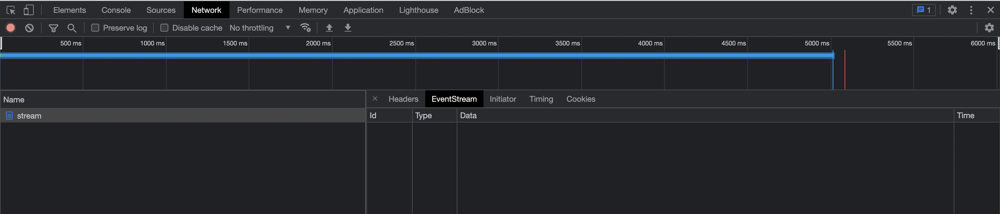

# poc-stream
## Goal
I would like to test the Symfony StreamedResponse, because I had no case to use that in production before.

## Conclusions
The built-in symfony-cli HTTP server `symfony serve` or `symfony server:run` does not work with StreamedResponse.
I created an issue in https://github.com/symfony-cli/symfony-cli/issues/67. This is probably because the GO
implementation has no use-case for that.

Therefore, to test it locally please use built-in PHP HTTP server `php -S localhost:8080`.

The `curl` does not handle streaming.

The Google Chrome browser has built EventStream tab:

How to use EventSource object: https://developer.mozilla.org/en-US/docs/Web/API/Server-sent_events/Using_server-sent_events
